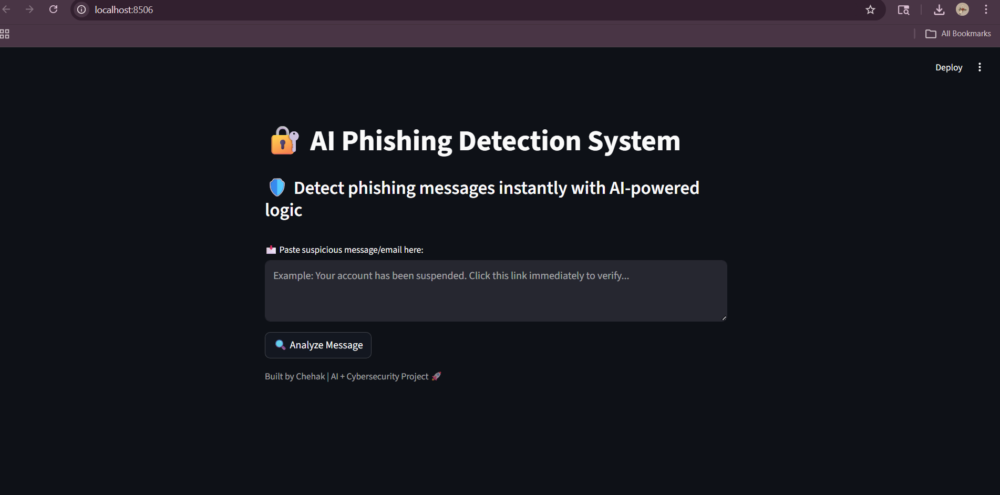

# 🔐 AI-Powered Phishing Detection System

An interactive web application that analyzes suspicious messages and detects potential phishing attempts using risk scoring and explainable insights.

---

## 🚀 Overview

This project simulates a real-world cybersecurity tool designed to identify phishing patterns in messages or emails. It evaluates user input and provides:

* A **risk score (0–100)**
* **Clear explanations** for detected threats
* **Recommended actions** for safer decision-making

---

## 🧠 Key Features

* 🔍 Detects phishing indicators (urgent language, links, sensitive info requests)
* 📊 Generates a **risk score with progress visualization**
* ⚠️ Classifies messages into **High / Medium / Low risk**
* 📌 Provides **reasons for detection**
* 🛡️ Suggests **recommended actions**
* 🎨 Built with an interactive Streamlit UI

---

## 🖼️ Screenshots

### 🏠 Homepage

---

### 🔴 High Risk Detection
  

---

### 🟡 Sample Result

---

## 🛠️ Tech Stack

* Python
* Streamlit

---

## ▶️ How to Run

1. Clone the repository
2. Install Streamlit
3. Run:
   streamlit run app.py

---

## 🎯 Future Improvements

* Add AI-based detection models
* Improve accuracy using real datasets
* Deploy as a live web application

---

## 👩‍💻 Author

**Chehak Tyagi**
AI + Cybersecurity 🚀
